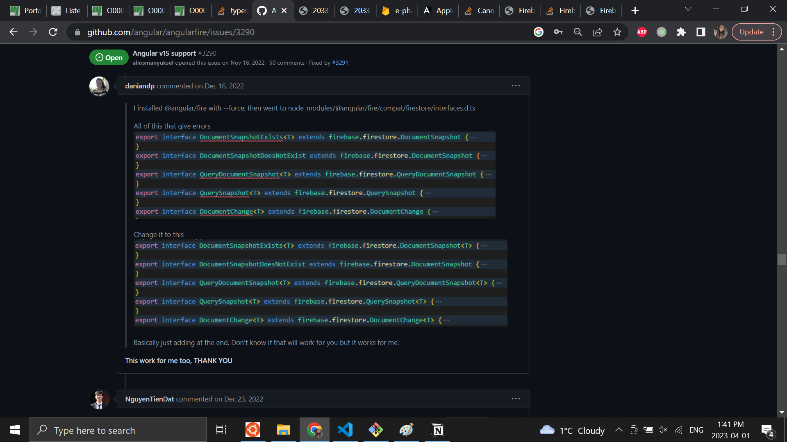

# Pour la correction
## Connexion client :
client@email.com : admin 123

## Connexion pharmacien :
pharmacien@email.com : admin 123

## Lien d'hébergement
https://e-pharma-inf1013-davydov.firebaseapp.com/

# Firebase
Firebase est un ensemble d'outils pour l'hébergement et le développement d'applications mobiles et web, qui permet l'envoi de notifications et de publicités, la remontée des erreurs et des clics effectués dans l'application.

## Erreur dans le module de firebase dans node_modules
Je n'ai pas trouvé de solution permanente. Je l'ai corrigé à la main.

## Configuration firebase.json
### Hosting
Le paramètre *public* doit avoir le chemin du build du projet. Dans le cas d'un projet Angular, ça sera `/dist/<nom-projet>`. Le nom du projet se situe dans angular.json sous `outputPath`.

### Rewrites
Paramètre permetant d'indiquer à firebase que peu importe le chemin, il faut passer par index.html étant donné que nous sommes dans une application single-page.

## Déploiement
Déployer le projet sur firebase en ligne de commande.
`firebase deploy --only hosting:e-pharma-inf1013-davydov`

# Application Angular

This project was generated with [Angular CLI](https://github.com/angular/angular-cli) version 15.1.2.

## Development server

Run `ng serve` for a dev server. Navigate to `http://localhost:4200/`. The application will automatically reload if you change any of the source files.

## Code scaffolding

Run `ng generate component component-name` to generate a new component. You can also use `ng generate directive|pipe|service|class|guard|interface|enum|module`.

## Build

Run `ng build` to build the project. The build artifacts will be stored in the `dist/` directory.

## Build new projet
Run `ng new name-of-project` to create a template for a new projet.

## Generate a component
Run `ng generate c name-of-component` to create a template for a new component.

## Run server
Run `ng serve` to run server.

## Running unit tests

Run `ng test` to execute the unit tests via [Karma](https://karma-runner.github.io).

## Running end-to-end tests

Run `ng e2e` to execute the end-to-end tests via a platform of your choice. To use this command, you need to first add a package that implements end-to-end testing capabilities.

## Further help

To get more help on the Angular CLI use `ng help` or go check out the [Angular CLI Overview and Command Reference](https://angular.io/cli) page.
